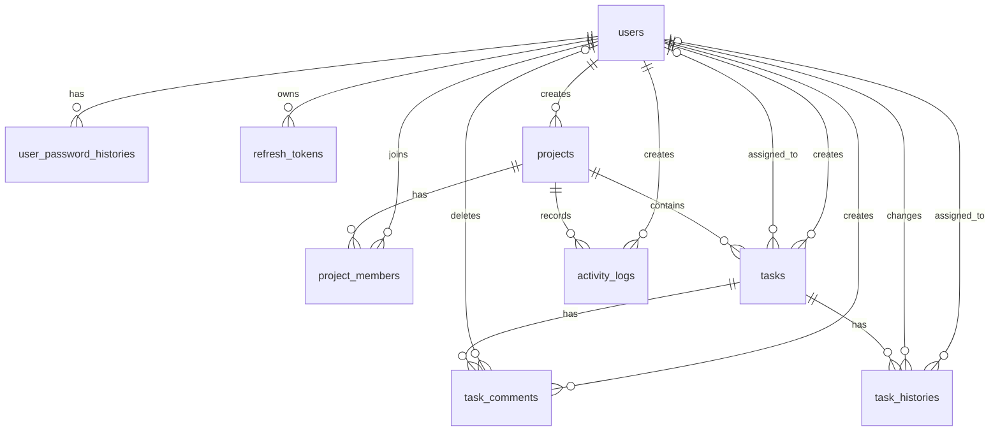

# Task Management ER Diagram

## Diagram

## Table definitions

### `users`

Stores user accounts, authentication state, and account status.

| Column | Type | Key | Nullable | Default | Description |
| --- | --- | --- | --- | --- | --- |
| `user_id` | bigint | PK | No | Identity | Unique identifier of the user |
| `username` | nvarchar(50) | UK | No | — | Username used to sign in |
| `password_hash` | nvarchar(255) | — | No | — | Hashed password |
| `display_name` | nvarchar(100) | — | Yes | — | Name displayed in the application |
| `email` | nvarchar(255) | UK | Yes | — | Email address of the user |
| `email_verified_at` | datetime2 | — | Yes | — | Date and time when the email was verified |
| `is_active` | bit | — | No | `1` | Indicates whether the account is active |
| `is_deleted` | bit | — | No | `0` | Indicates whether the account has been soft deleted |
| `is_locked` | bit | — | No | `0` | Indicates whether the account is locked |
| `failed_login_count` | int | — | No | `0` | Number of consecutive failed sign-in attempts |
| `locked_until` | datetime2 | — | Yes | — | Date and time when the account lock expires |
| `created_at` | datetime2 | — | No | — | Date and time when the account was created |
| `updated_at` | datetime2 | — | Yes | — | Date and time when the account was last updated |

### `user_password_histories`

Stores previously used passwords for password-reuse validation.

| Column | Type | Key | Nullable | Default | Description |
| --- | --- | --- | --- | --- | --- |
| `password_history_id` | bigint | PK | No | Identity | Unique identifier of the password history |
| `user_id` | bigint | FK → `users.user_id` | No | — | User associated with the password history |
| `password_hash` | nvarchar(255) | — | No | — | Previously used hashed password |
| `created_at` | datetime2 | — | No | — | Date and time when the password was stored |

### `refresh_tokens`

Stores refresh tokens issued to users.

| Column | Type | Key | Nullable | Default | Description |
| --- | --- | --- | --- | --- | --- |
| `refresh_token_id` | bigint | PK | No | Identity | Unique identifier of the refresh token |
| `user_id` | bigint | FK → `users.user_id` | No | — | User who owns the refresh token |
| `token_hash` | nvarchar(255) | UK | No | — | Hashed refresh token |
| `expires_at` | datetime2 | — | No | — | Date and time when the token expires |
| `created_at` | datetime2 | — | No | — | Date and time when the token was created |
| `revoked_at` | datetime2 | — | Yes | — | Date and time when the token was revoked |
| `is_revoked` | bit | — | No | `0` | Indicates whether the token has been revoked |

### `projects`

Stores project information and project visibility settings.

| Column | Type | Key | Nullable | Default | Description |
| --- | --- | --- | --- | --- | --- |
| `project_id` | bigint | PK | No | Identity | Unique identifier of the project |
| `project_name` | nvarchar(255) | UK | No | — | Name of the project |
| `is_active` | bit | — | No | `1` | Indicates whether the project is active |
| `is_deleted` | bit | — | No | `0` | Indicates whether the project has been soft deleted |
| `is_private` | bit | — | No | `1` | Indicates whether the project is private |
| `slug` | nvarchar(100) | UK | Yes | — | Unique slug used in the project URL |
| `can_view_by_url` | bit | — | No | `0` | Indicates whether the project can be viewed through its URL |
| `created_by` | bigint | FK → `users.user_id` | No | — | User who created the project |
| `created_at` | datetime2 | — | No | — | Date and time when the project was created |
| `updated_at` | datetime2 | — | Yes | — | Date and time when the project was last updated |

### `project_members`

Stores project members and their project-level roles.

| Column | Type | Key | Nullable | Default | Description |
| --- | --- | --- | --- | --- | --- |
| `project_member_id` | bigint | PK | No | Identity | Unique identifier of the project member |
| `project_id` | bigint | FK → `projects.project_id` | No | — | Project associated with the member |
| `user_id` | bigint | FK → `users.user_id` | No | — | User associated with the project |
| `role` | varchar(20) | — | No | `'member'` | Role of the user within the project |
| `is_active` | bit | — | No | `1` | Indicates whether the membership is active |
| `is_deleted` | bit | — | No | `0` | Indicates whether the membership has been soft deleted |
| `joined_at` | datetime2 | — | No | — | Date and time when the user joined the project |
| `created_at` | datetime2 | — | No | — | Date and time when the membership was created |
| `updated_at` | datetime2 | — | Yes | — | Date and time when the membership was last updated |

### `tasks`

Stores tasks associated with projects.

| Column | Type | Key | Nullable | Default | Description |
| --- | --- | --- | --- | --- | --- |
| `task_id` | bigint | PK | No | Identity | Unique identifier of the task |
| `project_id` | bigint | FK → `projects.project_id` | No | — | Project associated with the task |
| `task_code` | nvarchar(20) | — | No | — | Task code unique within the project |
| `task_name` | nvarchar(255) | — | No | — | Name of the task |
| `description` | nvarchar(max) | — | Yes | — | Detailed description of the task |
| `status` | varchar(20) | — | No | `'todo'` | Current status of the task |
| `priority` | varchar(20) | — | No | `'medium'` | Priority level of the task |
| `sort_order` | int | — | No | `0` | Display order within the status column |
| `created_by` | bigint | FK → `users.user_id` | No | — | User who created the task |
| `assigned_to` | bigint | FK → `users.user_id` | Yes | — | User currently assigned to the task |
| `start_date` | datetime2 | — | Yes | — | Planned start date of the task |
| `due_date` | datetime2 | — | Yes | — | Due date of the task |
| `completed_at` | datetime2 | — | Yes | — | Date and time when the task was completed |
| `is_active` | bit | — | No | `1` | Indicates whether the task is active |
| `is_deleted` | bit | — | No | `0` | Indicates whether the task has been soft deleted |
| `created_at` | datetime2 | — | No | — | Date and time when the task was created |
| `updated_at` | datetime2 | — | Yes | — | Date and time when the task was last updated |

### `task_comments`

Stores comments associated with tasks.

| Column | Type | Key | Nullable | Default | Description |
| --- | --- | --- | --- | --- | --- |
| `task_comment_id` | bigint | PK | No | Identity | Unique identifier of the task comment |
| `task_id` | bigint | FK → `tasks.task_id` | No | — | Task associated with the comment |
| `content` | nvarchar(max) | — | No | — | Content of the comment |
| `created_by` | bigint | FK → `users.user_id` | No | — | User who created the comment |
| `deleted_by` | bigint | FK → `users.user_id` | Yes | — | User who deleted the comment |
| `is_deleted` | bit | — | No | `0` | Indicates whether the comment has been soft deleted |
| `created_at` | datetime2 | — | No | — | Date and time when the comment was created |
| `deleted_at` | datetime2 | — | Yes | — | Date and time when the comment was deleted |

### `task_histories`

Stores task snapshots for change tracking and version history.

| Column | Type | Key | Nullable | Default | Description |
| --- | --- | --- | --- | --- | --- |
| `task_history_id` | bigint | PK | No | Identity | Unique identifier of the task history |
| `task_id` | bigint | FK → `tasks.task_id` | No | — | Task associated with the history |
| `version` | int | — | No | — | Version number of the task snapshot |
| `task_name` | nvarchar(255) | — | No | — | Task name at this version |
| `description` | nvarchar(max) | — | Yes | — | Task description at this version |
| `status` | varchar(20) | — | No | — | Task status at this version |
| `priority` | varchar(20) | — | No | — | Task priority at this version |
| `assigned_to` | bigint | FK → `users.user_id` | Yes | — | User assigned to the task at this version |
| `start_date` | datetime2 | — | Yes | — | Start date at this version |
| `due_date` | datetime2 | — | Yes | — | Due date at this version |
| `completed_at` | datetime2 | — | Yes | — | Completion date at this version |
| `changed_by` | bigint | FK → `users.user_id` | No | — | User who made the change |
| `changed_at` | datetime2 | — | No | — | Date and time when the change occurred |

### `activity_logs`

Stores project activity for timelines and recent-activity views.

| Column            | Type          | Key                        | Nullable | Default  | Description                              |
| ----------------- | ------------- | -------------------------- | -------- | -------- | ---------------------------------------- |
| `activity_log_id` | bigint        | PK                         | No       | Identity | Unique identifier of the activity log    |
| `project_id`      | bigint        | FK → `projects.project_id` | No       | —        | Project associated with the activity     |
| `activity_type`   | varchar(50)   | —                          | No       | —        | Type of activity performed               |
| `content`         | nvarchar(max) | —                          | No       | —        | Description of the activity              |
| `created_by`      | bigint        | FK → `users.user_id`       | No       | —        | User who performed the activity          |
| `created_at`      | datetime2     | —                          | No       | —        | Date and time when the activity occurred |

## Indexes and unique constraints

| Table | Columns | Type |
| --- | --- | --- |
| `users` | `username` | Unique constraint |
| `users` | `email` | Unique constraint |
| `refresh_tokens` | `token_hash` | Unique constraint |
| `projects` | `project_name` | Unique constraint |
| `projects` | `slug` | Unique constraint |
| `project_members` | `project_id`, `user_id` | Unique index |
| `tasks` | `project_id`, `task_code` | Unique index |
| `tasks` | `project_id`, `status` | Index |
| `tasks` | `assigned_to` | Index |
| `task_comments` | `task_id`, `created_at` | Index |
| `task_histories` | `task_id`, `version` | Unique index |
| `task_histories` | `task_id`, `changed_at` | Index |
| `activity_logs` | `project_id`, `created_at` | Index |
| `activity_logs` | `project_id`, `activity_type` | Index |
