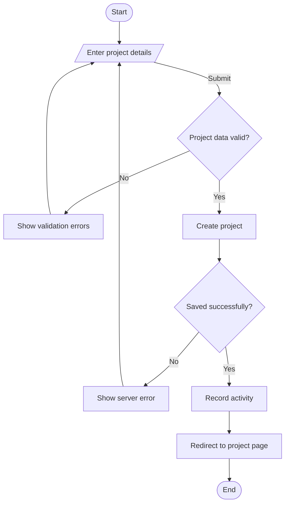
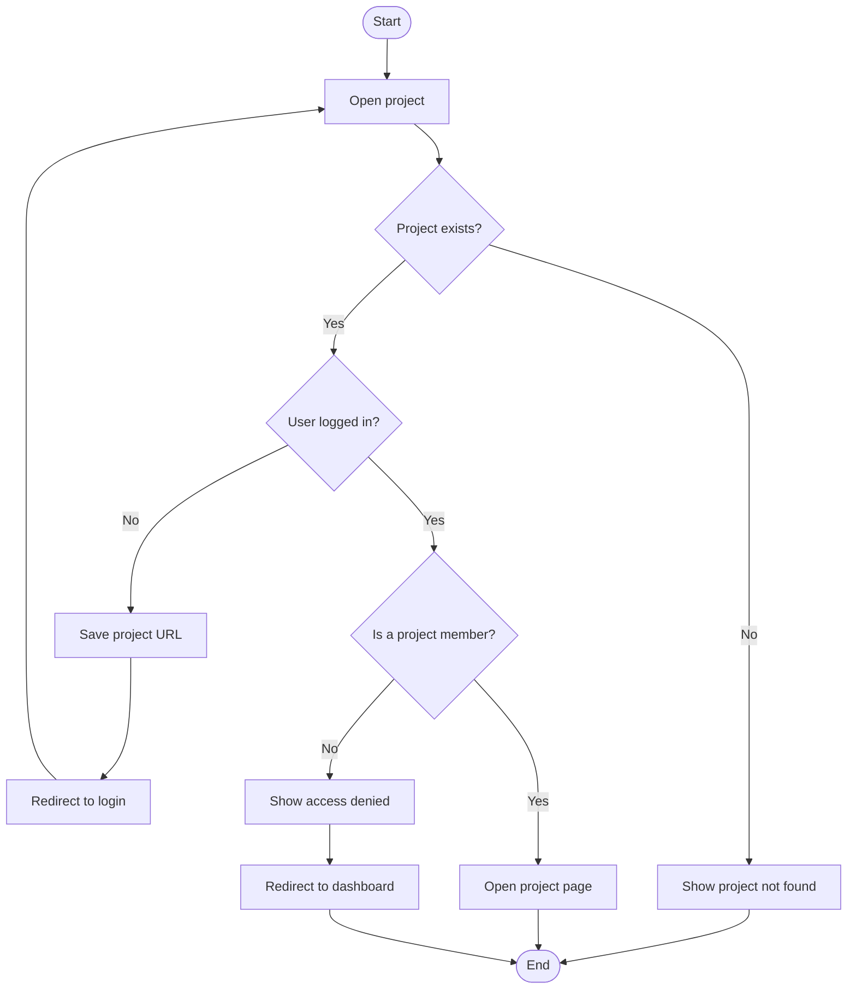
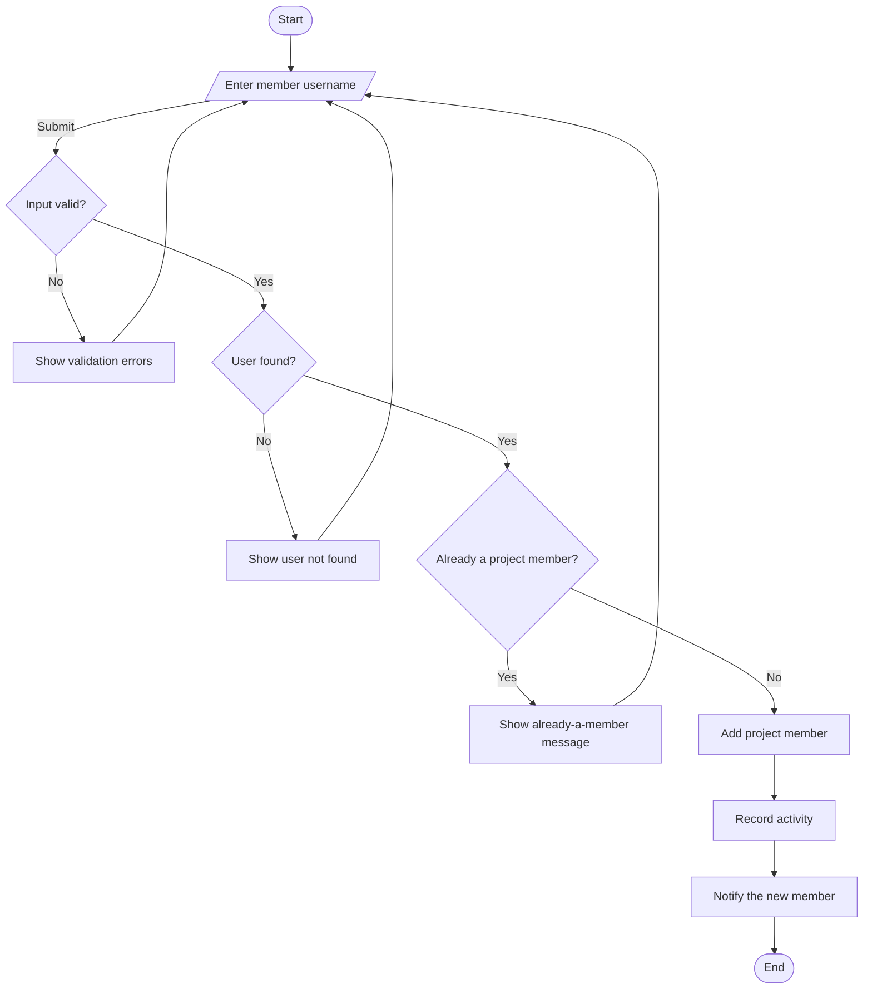

# Project Workflows

> A member's role is stored in `project_members.role`. The role-to-permission mapping is fixed in application code, so separate role and permission tables are not required. Any authenticated user can create a project.

## Create project workflow

## Open project workflow

## Add project member workflow

