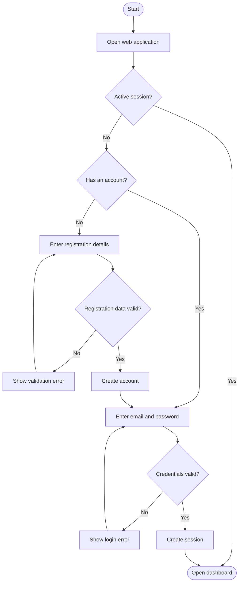
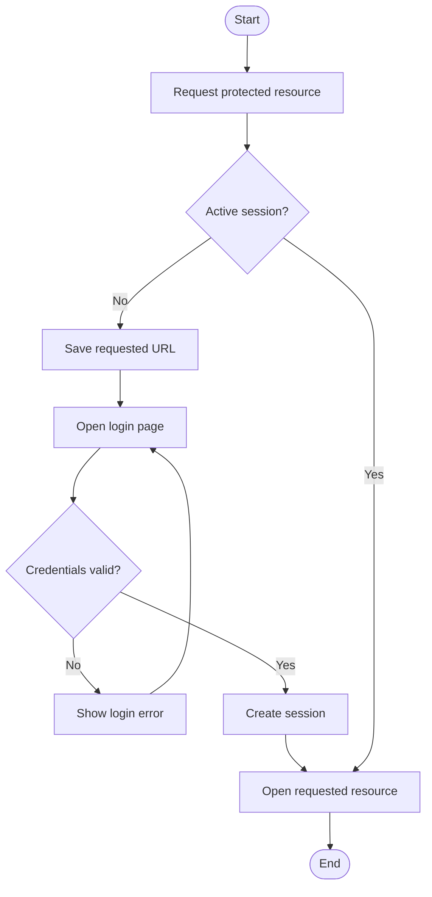

# Authentication Workflows

## Login and registration workflow

```mermaid
flowchart TD
    start([Start]) --> access["Open web application"]
    access --> session{"Active session?"}
    session -->|Yes| dashboard([Open dashboard])
    session -->|No| hasAccount{"Has an account?"}

    hasAccount -->|Yes| login["Enter email and password"]
    hasAccount -->|No| register["Enter registration details"]

    register --> validateRegistration{"Registration data valid?"}
    validateRegistration -->|No| registrationError["Show validation error"]
    registrationError --> register
    validateRegistration -->|Yes| createAccount["Create account"]
    createAccount --> login

    login --> validateLogin{"Credentials valid?"}
    validateLogin -->|No| loginError["Show login error"]
    loginError --> login
    validateLogin -->|Yes| createSession["Create session"]
    createSession --> dashboard
```

## Protected-resource redirect workflow

```mermaid
flowchart TD
    start([Start]) --> request["Request protected resource"]
    request --> session{"Active session?"}

    session -->|No| remember["Save requested URL"]
    remember --> login["Open login page"]
    login --> validateLogin{"Credentials valid?"}
    validateLogin -->|No| loginError["Show login error"]
    loginError --> login
    validateLogin -->|Yes| createSession["Create session"]
    createSession --> resource

    session -->|Yes| resource["Open requested resource"]
    resource --> finish([End])
```
