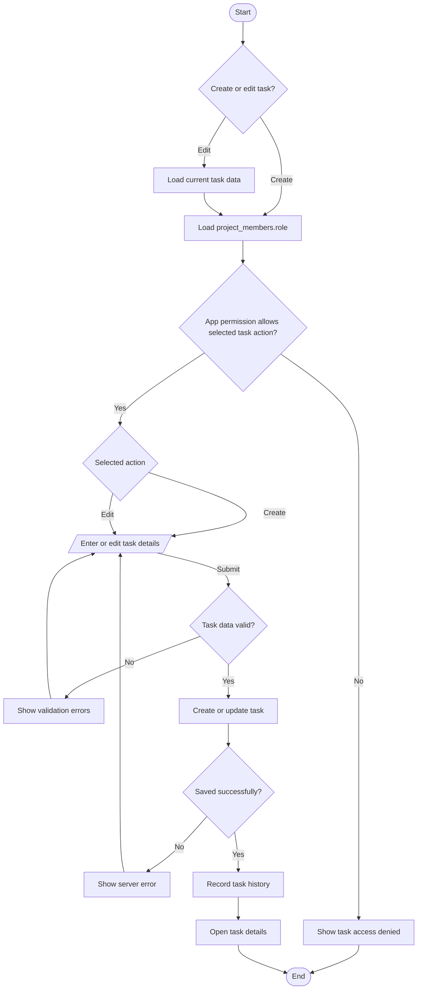
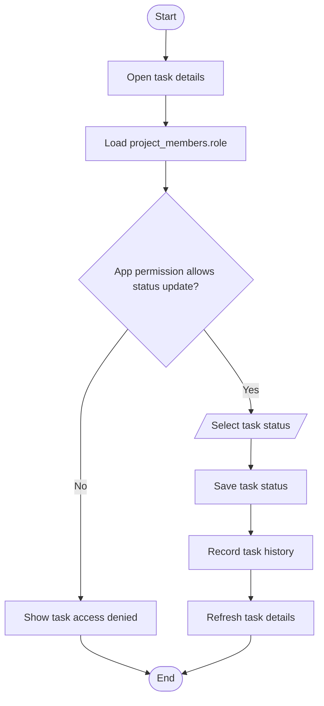
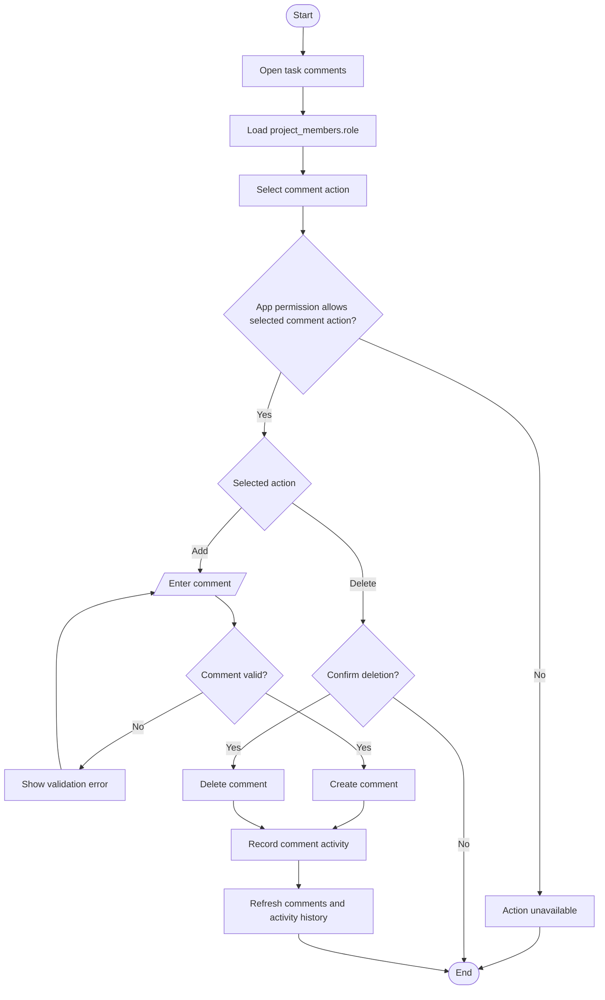

# Task Workflows

> Task actions use the member role stored in `project_members.role`. The application maps that role to permissions; permissions are not stored per task.

## Create or edit task workflow

## Task-status workflow

## Comment workflow

